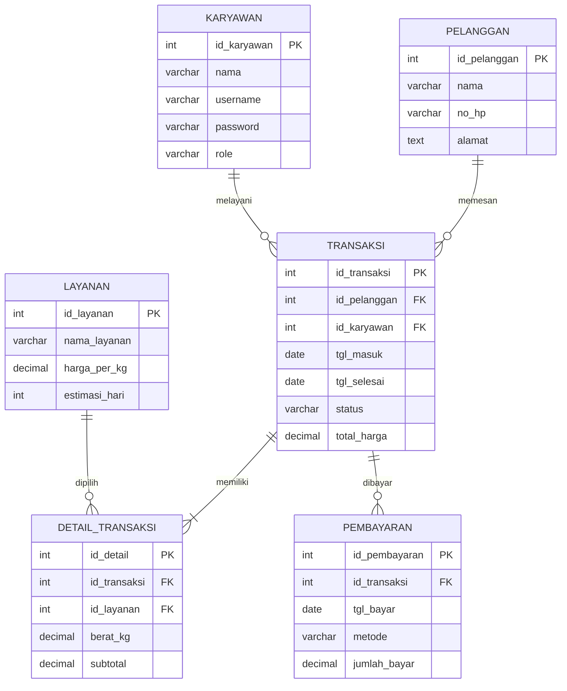

# Aplikasi & Sistem Basis Data Laundry (Laravel 5D)

Nama: M. Fajri Mubaraq
NPM: 2410010117
Kelas: Reg Ti 5C

Repository ini berisi proyek Laravel 5D beserta dokumentasi Entity Relationship Diagram (ERD) dan skema basis data sistem transaksi Laundry.

---

## 📊 Entity Relationship Diagram (ERD)

Diagram relasi antar tabel basis data Laundry. (GitHub secara otomatis merender blok `mermaid` di bawah ini menjadi gambar diagram interaktif).



---

## 📋 Keterangan Relasi & Kardinalitas

| Relasi                           | Kardinalitas | Penjelasan / Arti                                                      |
| -------------------------------- | ------------ | ---------------------------------------------------------------------- |
| `pelanggan` ➔ `transaksi`        | **1 : N**    | Satu pelanggan bisa melakukan transaksi/pemesanan berkali-kali.        |
| `karyawan` ➔ `transaksi`         | **1 : N**    | Satu karyawan (kasir) melayani banyak transaksi.                       |
| `transaksi` ➔ `detail_transaksi` | **1 : N**    | Satu nota transaksi berisi satu atau lebih item detail layanan cucian. |
| `layanan` ➔ `detail_transaksi`   | **1 : N**    | Satu jenis layanan dapat dipilih di banyak detail transaksi.           |
| `transaksi` ➔ `pembayaran`       | **1 : N**    | Satu transaksi bisa dibayar sekali lunas atau dicicil.                 |

### 🗝️ Keterangan Simbol ERD

- `PK`: Primary Key (Kunci Utama)
- `FK`: Foreign Key (Kunci Tamu)
- `||--o{`: Relasi satu ke nol atau banyak (One-to-Many Optional)
- `||--|{`: Relasi satu ke satu atau banyak (One-to-Many Mandatory)

---

## 🗄️ File Skema & Migrasi Database

- **File ERD Markdown**: [`database/ERD.md`](database/ERD.md)
- **File Script SQL Raw**: [`database/laundry_db.sql`](database/laundry_db.sql)
- **Model Laravel**:
    - `App\Models\Pelanggan`
    - `App\Models\Karyawan`
    - `App\Models\Layanan`
    - `App\Models\Transaksi`
    - `App\Models\DetailTransaksi`
    - `App\Models\Pembayaran`
- **Database Seeders**: `database/seeders/LaundrySeeder.php`

---

## 🚀 Panduan Menjalankan Proyek

1. **Clone Repository**:

    ```bash
    git clone https://github.com/Fajri-Mubaraq/laravel5d.git
    cd laravel5d
    ```

2. **Install Dependensi & Konfigurasi Environment**:

    ```bash
    composer install
    cp .env.example .env
    php artisan key:generate
    ```

3. **Migrasi Database & Seeder**:

    ```bash
    php artisan migrate --seed
    ```

4. **Jalankan Server Lokal**:
    ```bash
    php artisan serve
    ```
