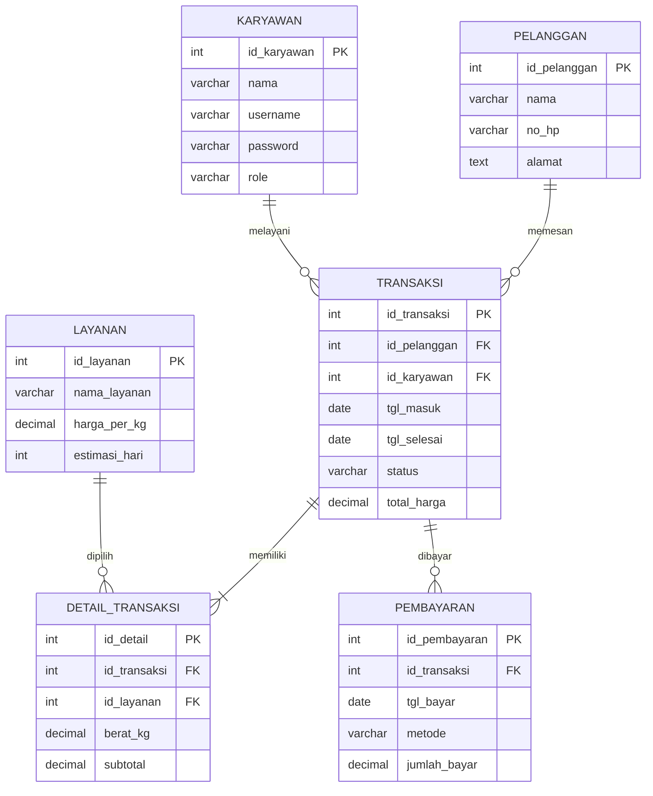

# ERD Basis Data Laundry

Diagram relasi antar tabel. GitHub, GitLab, dan VS Code (dengan ekstensi Markdown Preview Mermaid Support) menampilkan blok `mermaid` di bawah sebagai gambar.

## Keterangan Relasi

| Relasi | Kardinalitas | Arti |
|--------|--------------|------|
| `pelanggan` ke `transaksi` | 1 : N | Satu pelanggan bisa memesan berkali-kali |
| `karyawan` ke `transaksi` | 1 : N | Satu karyawan melayani banyak transaksi |
| `transaksi` ke `detail_transaksi` | 1 : N | Satu nota berisi satu atau lebih item cucian |
| `layanan` ke `detail_transaksi` | 1 : N | Satu layanan bisa muncul di banyak detail |
| `transaksi` ke `pembayaran` | 1 : N | Satu nota bisa dibayar sekali atau dicicil |

## Keterangan Simbol

- `PK`: primary key
- `FK`: foreign key
- `||--o{`: satu ke nol atau banyak
- `||--|{`: satu ke satu atau banyak
